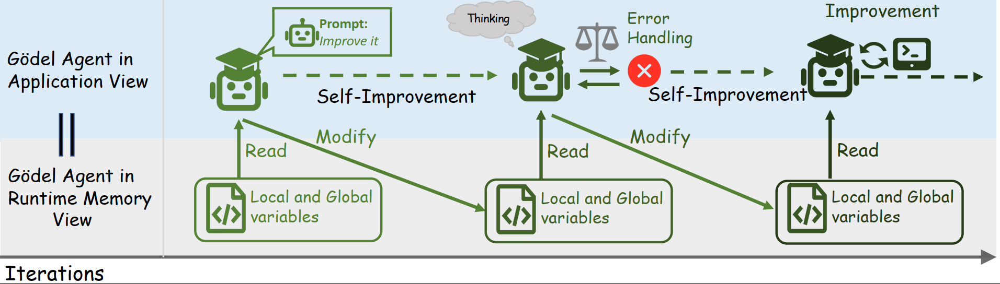

<div align="center">

</div>


# Gödel Agent: A Self-Referential Agent Framework for Recursive Self-Improvement
<div align="center">
<p align="center">
<a href="https://arxiv.org/abs/2410.04444">[Paper]</a>
<a href="#method-overview">[Overview]</a>
<a href="#installation">[Installation]</a>
<a href="#project-structure">[Structure]</a>
<a href="#citation">[Citation]</a>
</p>
---

</div>

## Method Overview





## Installation

1. Clone the repository:
   ```bash
   git clone https://github.com/Arvid-pku/Godel_Agent.git
   cd Godel_Agent
   ```

2. Install dependencies via `pip`:
   ```bash
   pip install -r requirements.txt
   ```

3. Navigate to the source directory and run the main script:
   ```bash
   cd src
   python main.py
   # You can adjust the task in the agent_module.py file.
   ```

## Project Structure

- `datasets/`: This folder contains the datasets used in the experiments.
  
- `results/`: Stores the self-optimized code generated by the model during each task, as well as the output generated by the model during tests.

- `src/`: This folder contains the code implementation.
  
  - `main.py`: The entry point for running the agent.
  - `agent_module.py`: Core implementation of the Gödel Agent, including the self-awareness, self-modification, and action execution logic.
  - `task_*.py`: Evaluation scripts for each task/environment. (adapted from [ADAS](https://github.com/ShengranHu/ADAS))
  - `logic.py`: Stores the generated agent code.
  - `wrap.py`: Used for debugging.
  - `goal_prompt.md`: Contains the goal prompt for the agent.

## Configuration

Make sure to configure your OpenAI API key in the `key.env` file before running the code.


## Citation

If you find our repository useful in your research, please kindly consider cite:
```bibtex
@misc{yin2024godelagentselfreferentialagent,
      title={G\"odel Agent: A Self-Referential Agent Framework for Recursive Self-Improvement}, 
      author={Xunjian Yin and Xinyi Wang and Liangming Pan and Xiaojun Wan and William Yang Wang},
      year={2024},
      eprint={2410.04444},
      archivePrefix={arXiv},
      primaryClass={cs.AI},
      url={https://arxiv.org/abs/2410.04444}, 
}
```
